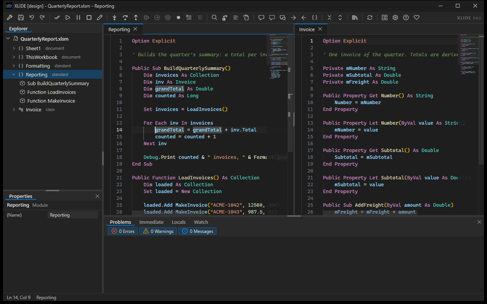

# xlide

[](https://github.com/WilliamSmithEdward/xlide_vbide/releases/latest)
[](LICENSE)
[](README.md)


***(Yes! This is really the VBA Editor in Excel)***

The Visual Basic Editor has looked the same since 1998. One module on screen at a time, a find
dialog that covers the code you are searching, less than helpful (or missing) completions, and no idea that
anything is wrong until you press F5 and it stops. xlide replaces that surface with Monaco, the
editor behind VS Code, running inside the VBE itself. Your workbooks stay where they are, your
macros run the way they always did, and F5, F8, and break mode behave exactly as before.

It installs in one double click, for your account only, with no administrator rights and nothing to
install first.

## What it is

xlide is a native add-in that the VBE loads through its own extensibility model - the same editor
Excel, Word, PowerPoint and Access all share, so one install reaches every one of them. It draws
over the VBE's document area and puts a modern editing surface there: every open module live at
once, editors side by side, diagnostics as you type. The native editor keeps running underneath as
the text of record, the compile target, and the debugger, so nothing about how your code compiles or
runs changes.

The analysis comes from a VBA analyzer validated against the real compiler over a corpus of
thousands of modules, and it runs in its own process. That matters because the VBE is single
threaded and owns the thread you type on: a project large enough to take seconds to analyse cannot
stall your typing if the analysis is not happening there. The add-in is compiled ahead of time to
native code, so Excel never loads a .NET runtime on its account.

## What you get

- Monaco editing over every code pane, with VBA syntax highlighting, folding, multi-cursor, and
  bookmarks that stay with the module.
- Diagnostics as you type, with severity filters and a Problems panel that navigates to the line.
- Completion, hover, and signature help from the analyzer, plus typing that follows VBA's own
  conventions: auto-casing, block closers, smart Enter and Tab, and auto-indent.
- Every open module holds a live editor. Switching tabs takes a median of 2.5ms and keeps your undo
  history, scroll position, and squiggles.
- Editor groups. Split right or down with Ctrl+\, drag a tab to a group's edge, and work in two
  modules at once.
- Nine tool panes that dock where you put them: Explorer, Properties, Problems, Immediate,
  Locals, Watch, Tests, Changes and Source Control. Drag one by its title and a five-zone compass
  appears over the region under the pointer. The arrangement persists.
- Search as one floating widget, scoped to the module, the workbook, or every open workbook. Find
  All lists every match with a preview, and Replace All applies as a single edit that one undo
  reverts.
- Locals and Watch track the debugger through every step, with breakpoints, Run to Cursor, Set Next
  Statement, and the rest of the debug commands on the toolbar.
- An Object Browser as a floating themed window, covering your open projects and every referenced
  type library, read directly from the type libraries themselves. Members of your own modules jump
  to their definition on a double click.
- The hidden attributes, through annotations: `'@PredeclaredId`, `'@Description("...")`,
  `'@DefaultMember`, `'@Enumerator`, `'@ExcelHotkey("D")` and the rest of the Rubberduck set are
  read from the code, the drift from what the saved module carries is filed in the Problems pane,
  and saving the workbook writes them - the one thing in the VBE nothing else can set.
- A project explorer rooted at each open workbook, with project-qualified addressing, so two
  workbooks can both hold a Module1 and xlide knows which one you mean. A second layout groups
  modules into folders by the `'@Folder("Parent.Child")` comment at the top of each one, the
  Rubberduck convention, so a project organised there is organised here without editing a line.
- The procedure the caret is in, on the status bar beside the module name and marked in the
  explorer, so where you are reads off the screen without scrolling up.
- An Immediate panel that mirrors the native window live, and a close-confirm on a dirty tab that
  reverts everywhere when you choose not to save.
- A UserForm designer: drag, resize, nudge and reparent controls on a canvas, with a text view of
  the same form beside it that edits the same document. Both halves are one undo stack, and the
  form is not touched until you press Ctrl+S.
- A test runner. Mark procedures with `@xlide-test`, run them against the live project, and read
  the outcomes in a Tests pane that shows nothing rather than stale green when the project cannot
  execute a line.
- A Changes pane: what an agent, or you, changed in this project, in rounds, newest first, with
  the text from before kept so you can read it - and restored from: any round, one module or the
  whole project, or Reject everything since you last accepted. A restore is recorded as a round
  like any other change, so it can itself be restored away.
- A Source Control pane, backed by the git you already have. Your modules live against the
  branch head; tick the ones to commit and type a message, pre-filled from what changed since the
  last commit. History opens to the modules each commit touched, with Open this version and
  Restore; blame paints author, date and hash at the end of every committed line; the branch is
  a select; Fetch, Pull and Push are buttons. Git for Windows' own credential manager handles
  signing in, and xlide never sees a credential.
- Analyzer rules you can change. A searchable dialog, a right-click on any finding to suppress it
  here or turn it off on this machine, and the same switch on the lightbulb. Rules that mirror a
  VBE compile failure say so instead of offering a switch that would be ignored.
- A local api, off by default, that lets an agent read a module, write one, run a test and drive
  the editor. One switch on a card that explains exactly what turning it on allows.

## Installing

Download `xlide-setup.exe` from [Releases](https://github.com/WilliamSmithEdward/xlide_vbide/releases)
and run it.

It installs to `%LOCALAPPDATA%\Programs\xlide` for the current user. It asks for no administrator
rights, changes nothing outside your own profile, and needs no runtime, framework, or tool to be
present first. Everything it needs is inside the one executable. Windows will warn before running
it, because it carries no code signature yet.

Close Excel first. If it is open, the installer says so and offers to wait while you close it, or to
force close it for you.

Then start Excel and press Alt+F11.

## Uninstalling

Settings, then Apps, then Installed apps. Find xlide and choose Uninstall. You can also run
`xlide-setup.exe --uninstall` from `%LOCALAPPDATA%\Programs\xlide`, where a copy of the installer is
kept so that removing xlide never depends on still having the download.

Removal takes out the program files, the per-user registration, and xlide's own logs and cache.
Your VBA is untouched throughout: it lives in your workbooks and xlide never writes to them.

One thing to expect afterwards. xlide hides the VBE's own tool windows while it is covering the
screen, and the editor remembers the window layout it was last left with. So the first time you open
the VBE after removing xlide, it will be empty. Use the View menu to bring back the ones you want:
Project Explorer, Properties Window, Immediate Window, Locals Window, and Watch Window.

---

# For developers

Everything below this line is about working on xlide. None of it is needed to use it. If you
installed from the release, you are done: start Excel and press Alt+F11.

## Building from source

### What you need first

- **Windows**, and 64-bit Microsoft 365. The add-in is a COM add-in for the VBE, so it can only be
  built and run where that editor is.
- **The .NET 10 SDK.** The shim targets `net10.0-windows`.
- **The C++ build tools**, which is what ahead-of-time compilation links against. Install the
  "Desktop development with C++" workload from the Visual Studio Installer; Build Tools alone is
  enough, Visual Studio itself is not required.
- **Node 20 or newer**, for the language engine and the editor page.
- **The analyzer checkout, beside this one.** This is the part that is easy to miss. The engine
  does not vendor the analyzer, it compiles it from
  [xlide_vscode](https://github.com/WilliamSmithEdward/xlide_vscode)'s own source, so that both
  products agree on what VBA means. Clone it as a sibling directory:

  ```text
  ...\xlide\
      xlide_vbide\      this repository
      xlide_vscode\     the analyzer, cloned beside it
  ```

  Without it the engine build stops and says so. The path is `engine/build.mjs` if you keep your
  checkouts somewhere else.

### The first build

```powershell
npm install --prefix engine        # the language engine's dependencies
npm install --prefix ui\editor     # the editor page's dependencies
tools\dev.ps1                      # build everything, register, and open a real editor
```

`tools\dev.ps1` is the whole loop in one command: it builds and tests the engine and the page,
publishes the shim ahead-of-time, registers it for the current user, then starts Excel and
verifies the add-in actually loaded. It builds **Release** by default; pass
`-Configuration Debug` for a build with the local api door in it, which is what the harness and
every suite in `tools\harness` drive. `-KeepOpen` leaves Excel running to work in,
`-NoRun` stops after registering, and `-Unregister` takes the registration off the machine again.

### Building one part at a time

```powershell
tools\page.ps1                     # rebuild the editor surface and reload it live, ~1s
npm run build --prefix engine      # bundle the engine
npm run package --prefix engine    # bundle it and produce xlide-engine.exe
dotnet build xlide_vbide.slnx      # the shim and its unit tests, without publishing
```

`tools\page.ps1` is the fast loop: it typechecks, builds, copies the bundle into the published
shim and reloads the page in a running editor, without restarting Excel or republishing anything.

### Checking it

```powershell
tools\verify.ps1                   # 19 headless steps, about ninety seconds
tools\verify.ps1 -Live             # adds four steps that need an open editor
tools\verify.ps1 -Deep             # four more; the tier to run before a release
```

The live tiers drive real hosts against fixtures in `artifacts\fixtures`, which are build output
rather than checked in. Each has a generator in `tools` - `New-TestFixture.ps1`,
`New-AccessFixture.ps1` and the rest - and they need a **Debug** build registered first, because
they are built through the local api door rather than through the VBA project object model, which
means "Trust access to the VBA project object model" does not have to be on.

### The installer

```powershell
installer\build.ps1                # produces artifacts\xlide-setup.exe
```

It refuses to build without a packaged engine and a built page, so an incomplete build fails here
rather than being discovered by whoever downloads it.

## Repository layout

| Path | Purpose |
| --- | --- |
| `src/Xlide.Vbe.Shim` | The native add-in: editor integration, tool windows, browser surface |
| `src/Xlide.Vbe.Core` | Host-independent logic for the add-in, with no COM or Win32 |
| `engine/` | The language engine sidecar |
| `ui/` | The editor surface rendered in the browser control |
| `installer/` | The single-file installer |
| `tools/` | Development scripts and the integration harness |
| `tests/` | Unit tests. None of them need Excel |
| `docs/` | Architecture, decisions, and findings |

## Documentation

[docs/status.md](docs/status.md) is the current snapshot: what is proven and how.
[docs/architecture.md](docs/architecture.md) covers the design, and
[docs/decisions.md](docs/decisions.md) records the choices that would be expensive to reverse along
with the reasoning behind each. [docs/lessons.md](docs/lessons.md),
[docs/ui-lessons.md](docs/ui-lessons.md), and [docs/editor-windows.md](docs/editor-windows.md) hold
behaviour of the host that is documented nowhere else and was established by measurement.
The newest handover is written for someone starting cold: the highest-dated `docs/handoff-*.md`. They are dated because each supersedes the last, so the most recent one wins and the others are history.

## About the code

This is a clean-room implementation built on Microsoft's documented interfaces: the editor
extensibility model, the forms designer object model, Win32, and published binary format
specifications. The analyzer is the author's own prior work, shared with the
[XLIDE editor extension](https://github.com/WilliamSmithEdward/xlide_vscode) so that both products
agree on what VBA means.

## License

[MIT](LICENSE).
